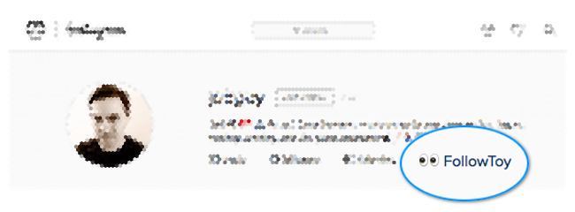

**⚠️ This project is no longer being maintained.**

# FollowToy
FollowToy is a simple [Safari](http://www.apple.com/safari/) browser extension that lets you see who is (and isn't) following you back on Instagram. Once installed you will see a new "FollowToy" link on your profile page when you are signed in. See screenshot below:

### Why?
The [Instagram](https://www.instagram.com) website and mobile app currently provide you with a list of who you follow and who follows you. My daughter lamented that there was no quick way for her to verify who was *following her back* on Instagram. I was surprised to discover that Instagram didn't include this detail in her "following" list. Like any geeky dad seeking his teenage daughter's adoration would do, I set off to create a sweet solution for her. **FollowToy** is the result. The name "FollowToy" rolls off the tongue similarly to the name of one of her [favourite bands](http://falloutboy.com) too which scores me some bonus points. 🤓

#### Disclaimer
This project is neither endorsed by or affiliated with Instagram in any way. No warranty is expressed or implied. Use at your own risk.

#### Additional comments
Hopefully you find this extension to be useful. It has a known limitation in that it can handle a "following" list with a maximum size of 9999. This limit is enforced by the Instagram server script that FollowToy relies on. In reality this shouldn't be a big deal as scrolling through a 10000 item list is unlikely to be anybody's idea of a good time.

If you'd like to follow me on Instagram, my username there is [joltguy](https://www.instagram.com/joltguy). Enjoy!
